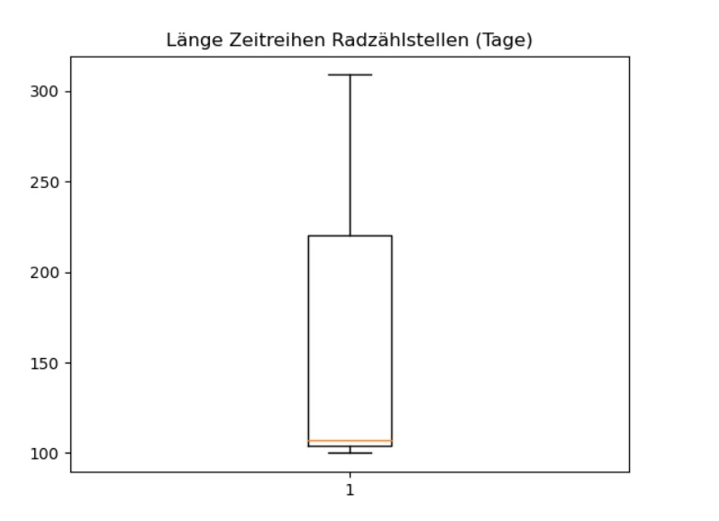
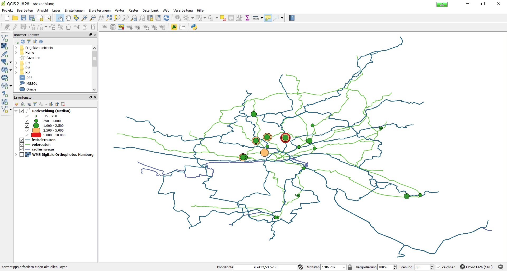
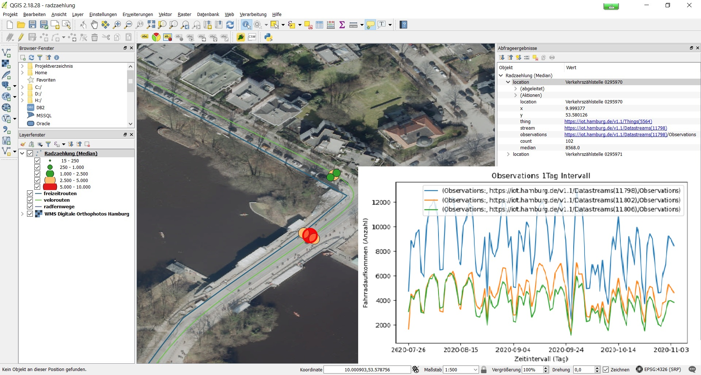
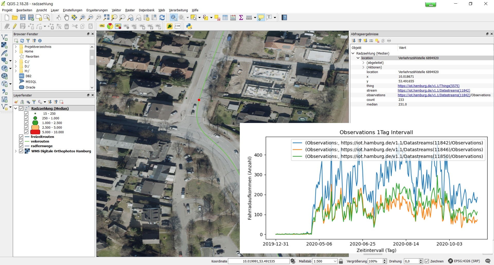

#

SensorThings API - Use Case
===========================

## Inhalt
* [Einleitung](#einleitung)
* [Quantität und Qualität der Zeitreihen](#quantität-und-qualität-der-zeitreihen)
* [Überblick Radzählungen](#überblick-radzählungen)
* [Summary](#summary)

## Einleitung
Nachdem wir uns im Repository [iot-sta](https://github.com/enatgvhh/iot-sta) mit der [SensorThings API](https://iot.hamburg.de/v1.1) vertraut gemacht und uns angesehen haben, wie gut ein Nutzer damit arbeiten kann, wollen wir in diesem Beitrag erodieren, was man mit den Daten anfangen kann. Für die fast Echtzeitdaten, die über den MQTT-Broker bezogen werden können, liegt der Use Case auf der Hand. Wir wollen uns deshalb auf die aggregierten Zeitreihen konzentrieren. Was können wir mit den Radzählungen im 15min, 1h, 1d, 1w Intervall anfangen? 

## Quantität und Qualität der Zeitreihen
Wir hatten im Repository [iot-sta](https://github.com/enatgvhh/iot-sta) bereits festgestellt, dass die Zeitreihen der Verkehrszählungen sehr kurz sind. Das schauen wir uns jetzt etwas genauer an und ziehen dazu die Radzählungen im 1 Tag Intervall heran, da wir diese möglicherweise zur Prüfung einer Korrelation zu Parametern wie Temperatur, Niederschlag oder COVID-19 Fällen heranziehen können. Die Länge der Zeitreihen lässt sich am einfachsten mit einem Boxplot (*vgl. Abb. 1*) veranschaulichen. Aus dem Boxplot entnehmen wir, dass sich 50% aller Zeitreihen über weniger als 107 Tage erstrecken. Zudem erkennen wir aus *Abb. 4*, dass in den Zeitreihen Mess- und Verfahrensfehler enthalten sind. Es fehlt bei der Datenprozessierung offensichtlich eine Qualitätskontrolle. In der Praxis können wir mit diesen Daten also noch sehr wenig anfangen.

Abb. 1: Boxplot mit Länge der Zeitreihen

## Überblick Radzählungen
Wir wollen uns aber zumindest einen kurzen Überblick über die Radzählstellen verschaffen. Dazu nutzen wir diesen [Python Client](src/staClient_5_medianGeo.py), der uns für jede Zeitreihe den Median in ein [csv-file](data/radzaehlung_download.csv) schreibt. Wo sich die 61 Zählstellen befinden, das zeigt uns die *Abb. 2* sehr anschaulich. Die Zählstelle mit den meisten Radzählungen pro Tag (*max. 13.051*) befindet sich auf der Krugkoppelbrücke über der Außen-Alster. Ein Beispiel für eine Zählstelle mit Mess- und Verfahrensfehlern finden wir in der Otto-Brenner-Straße in Wilhelmsburg (*vgl. Abb. 4*).

Abb. 2: Radzählstellen Überblick

Abb. 3: Radzählstellen Krugkoppelbrücke

Abb. 4: Radzählstellen Otto-Brenner-Straße

## Summary
Die Suche nach einem vernünftigen Use Case für die Sensordaten blieb an dieser Stelle erfolglos. Lediglich für die fast Echtzeitdaten, wie den Status der E-Ladestationen, liegt er auf der Hand. Diese könnten es bsp. Unternehmen der Alphabet Inc. (*10 Mrd. US Dollar Gewinn 4. Quartal 2019*), wie  [Google](https://www.google.de/maps)  oder  [WAZE](https://www.waze.com/de/livemap), ermöglichen, ihr Geschäftsmodell ein wenig zu erweitern.
